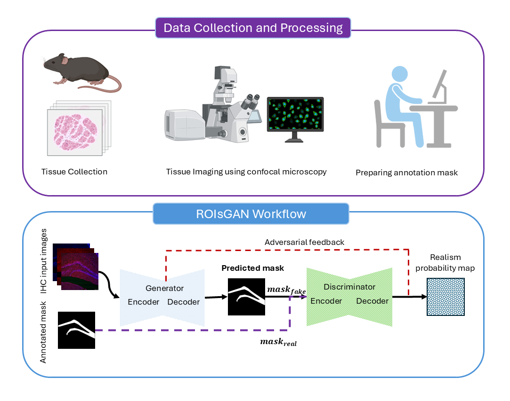

# ROIsGAN: A Region Guided Generative Adversarial Framework for Murine Hippocampal Subregion Segmentation

### Overview
This repository contains the implementation of ROIsGAN, a generative adversarial network (GAN) designed for segmenting murine hippocampal subregions from immunohistochemistry tissue images. The framework combines a U-Net-based generator with a region-guided discriminator to enhance segmentation performance for neuroscience applications.


### Dataset
The dataset introduced in his study can be downloaded [here!](https://rutgers.box.com/v/HippocampalROISegDataset).

### Installation, Training and Inference
#### [1]. **Clone the Repository**:
   ```bash
   git clone https://github.com/yourusername/ROIsGAN.git
   cd ROIsGAN
   ```
#### [2]. **Create a conda environment with all required packages**
```bash
conda create --name env_name --file requirements.txt
```
#### [3] Activate the environment
```bash
conda activate env_name
```
#### [4] Test Command-line #1: Run on Default Dataset
```bash
python main.py
```
#### [5] Test Command-line #2: Run on different dataset
```bash
python main.py --image_dir input_image_directory --mask_dir annotation_masks_dir 
```

