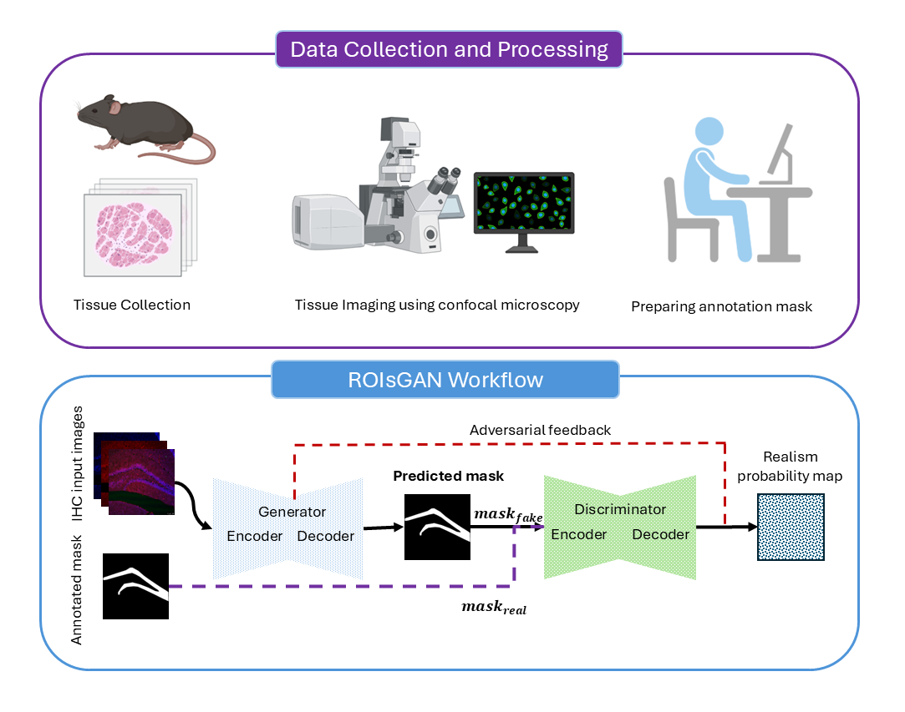

# ROIsGAN: A Region Guided Generative Adversarial Framework for Murine Hippocampal Subregion Segmentation

## Overview
This repository contains the implementation of ROIsGAN, a generative adversarial network (GAN) designed for segmenting murine hippocampal subregions from immunohistochemistry tissue images. The framework combines a U-Net-based generator with a discriminator, incorporating custom filter initialization options to enhance segmentation performance for neuroscience applications.



## Installation
1. **Clone the Repository**:
   ```bash
   git clone https://github.com/yourusername/ROIsGAN.git
   cd ROIsGAN
